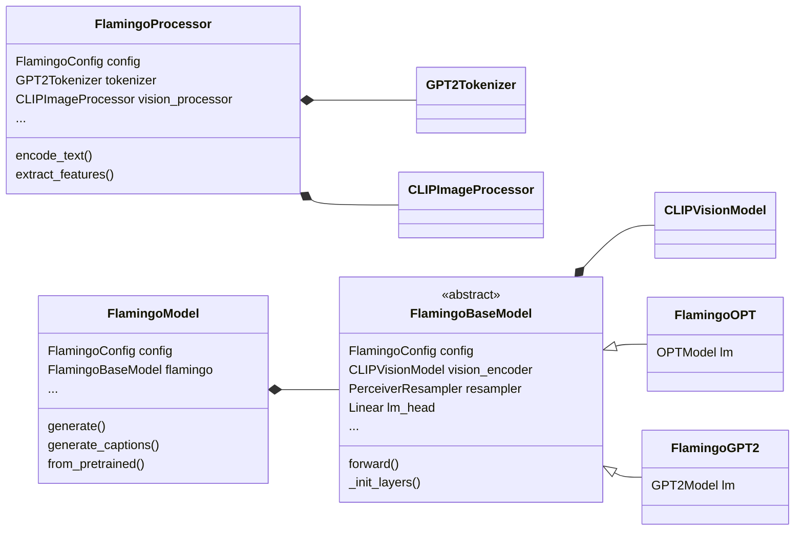

# Flamingo mini
Implementation of the <a href="https://www.deepmind.com/blog/tackling-multiple-tasks-with-a-single-visual-language-model" target="blank">deepmind  Flamingo</a> vision-language model, which enables an existing language model with to understand visual input such as images or videos. The code is based on <a href="https://github.com/lucidrains/flamingo-pytorch" target="blank">Lucidrains implementation</a> of the perceiver resampler and the gated cross-attention layers, and utilizes pretrained vision and language models from <a href="https://huggingface.co/" target="blank"> 🤗 Hugging Face</a>. At the moment there are two versions available, based on GPT-2 and OPT. They have been tested with openai CLIP vision encoders `openai/clip-vit-base-patch32` and `openai/clip-vit-large-patch14`.  

(!) Note that this repo is work in progress and may be subject to breaking changes.  

- [x] ~~provide simple training script -> currently in a separate branch: https://github.com/dhansmair/flamingo-mini/tree/training~~
- [x] demo training script with huggingface trainer: https://github.com/dhansmair/flamingo-mini/tree/main/training
- [ ] <a href="https://huggingface.co/docs/transformers/v4.25.1/en/main_classes/pipelines" target="blank">pipeline</a> integration
- [ ] create chatting demo


## Demo
A pretrained model is available at https://huggingface.co/dhansmair/flamingo-mini. You can find a demo of the model in <a href="https://huggingface.co/spaces/dhansmair/flamingo-mini-cap" target="blank">this hf space</a>.
Disclaimer: This model was trained for image captioning on the <a href="https://ai.google.com/research/ConceptualCaptions/" target="blank">Conceptual Captions</a> dataset. In contrast, Deepmind's original flamingo models have been trained on huge interleaved image-text datasets which are not publicly accessible. Because of that, our model does not have the same few-shot capabilities, nor the exciting chatting abilities as the original. 
 
### Will there be a stronger pretrained model released?
Unfortunately I don't have time at the moment to put more effort into model pretraining.  
For generative models that can ingest *single* images, there are other promising alternatives such as <a href="https://huggingface.co/docs/transformers/main/model_doc/blip-2" target="blank">BLIP-2</a> which can already be used for inference/finetuning.  
The big selling point of Flamingo is the ability to handle interleaved vision-language data, but pretraining requires interleaved datasets, which we don't have at the moment.  
But apparently, Hugging Face is also working on replicating Flamingo: https://www.linkedin.com/posts/victor-sanh_multimodal-llm-deeplearning-activity-7038583909994885120-BjsF  
as well as LAION: https://laion.ai/blog/open-flamingo/


## Install
(requires python 3.7)

```bash
git clone https://github.com/dhansmair/flamingo-mini.git
cd flamingo-mini
pip install .
```

## Usage
The implementation aims to be compatible with the Hugging Face transformers library and largely adopts their api. It inherits `PreTrainedModel`, so you can use methods such as `save_pretrained()`, `from_pretrained()` and `push_to_hub()`. Powered by hf transformers, the model is enabled with different text generation strategies such as beam search and sampling strategies such as top-k sampling.

```python
from flamingo_mini import FlamingoConfig, FlamingoModel, FlamingoProcessor

# create a model for training
device = ...
config = FlamingoConfig(...)
model = FlamingoModel(config)
model.to(device)
processor = FlamingoProcessor(config, device=device)
```
### Parameters
You can specify the architecture by passing the following parameters to FlamingoConfig():  
```python
lm: str = 'gpt2'                    # select language model. Possible values: gpt2, gpt2-*, facebook/opt-*
clip_model_type: str = 'openai/clip-vit-base-patch32'      
                                    # vision encoder. Possible other: openai/clip-vit-large-patch14
dim: int = 1024                     # length of a language token, depends on used language model
dim_visual: int = 768               # length of a visual feature, depends on the vision encoder
xattn_every: int = 1                # frequency of interleaved xattn layers
xattn_dim_head: int = 64
xattn_heads: int = 8
xattn_ff_mult: int = 4
xattn_act: str = 'gelu'             # activation function in the xattn FFW blocks. Possible values: gelu, sqrelu, relu

resampler_depth: int = 6            # number of layers of the perceiver resampler
resampler_dim_head: int = 64
resampler_heads: int = 8
resampler_num_latents: int = 64     # number of queries
resampler_num_time_embeds: int = 4
resampler_ff_mult: int = 4
resampler_act: str = 'gelu'         # activation function in the resampler FFW blocks. Possible values: gelu, sqrelu, relu
freeze_language_model: bool = True
freeze_vision_model: bool = True

```

### Load pretrained image-captioning model
```python
model = FlamingoModel.from_pretrained('dhansmair/flamingo-mini')           # or flamingo-tiny
processor = FlamingoProcessor(model.config)
```
Details about the model configurations: https://github.com/dhansmair/flamingo-mini/wiki/Model-Configurations
A complete example is provided in `examples/image_captioning.py`.


## Training
A core idea of Flamingo is to reuse off-the-shelf language model and vision encoder. As such, their weights are frozen during flamingo training, and only the perceiver resampler and the gated cross-attention layers are updated. 
We can do that by setting the parameters `freeze_language_model` and `freeze_vision_model`, which are True by default (There is also methods `model.freeze_lm()` and `model.freeze_vm()`).  
Note that in our implementation, this does not freeze the (shared) weights of lm_head / token embeddings, as the embedding for the `<EOC>` token needs to be learned.  

~~I am working on a training script with <a href="https://huggingface.co/docs/transformers/main_classes/trainer" target="blank">hf trainer</a>, and the current model is largely compatible with trainer.~~  
A basic training script is here: https://github.com/dhansmair/flamingo-mini/tree/hf_trainer

### Using a different language model
The FlamingoModel is implemented in such a way that no modification of the underlying language model's source code is necessary, so it should be relatively easy to extend the code to other models. However, some steps are required: Add a new `<EOC>` token to the vocabulary of tokenizer and language model. hf transformers offers a `resize_token_embeddings()` utility to adjust both the token embedding matrix and lm_head. FlamingoGPT2 and FlamingoOPT should give a good starting point. To inject the gated cross-attention layers, replace layers in the lm with wrappers using the `_init_layers()` method.
Every language model comes with a specific tokenizer, so make sure to adapt FlamingoProcessor to use the correct tokenizer.

### Using a different vision encoder
By default, the model uses the CLIP ViT-B vision encoder. A different encoder size can be set with the `clip_model_type` parameter.
If you want to use a completely different encoder, e.g. ResNet, you will need to adjust FlamingoProcessor and replace the `vision_processor` property.
You will also need to replace the `vision_encoder` property of FlamingoBaseModel and override the method `encode_resample_visuals()`.

A high level overview of this repository:



## Acknowledgements

- The code is based on <a href="https://github.com/lucidrains/flamingo-pytorch" targe="blank">Lucidrains implementation</a> of the perceiver resampler and the gated cross-attention layers.
- It utilizes pretrained vision and language models hosted on <a href="https://huggingface.co/" target="blank"> 🤗 Hugging Face</a>.
  - OPT: https://huggingface.co/facebook/opt-350m, https://huggingface.co/facebook/opt-125m
  - CLIP ViT: https://huggingface.co/openai/clip-vit-large-patch14

## Citations

```bibtex
@article{Alayrac2022Flamingo,
    title   = {Flamingo: a Visual Language Model for Few-Shot Learning},
    author  = {Jean-Baptiste Alayrac et al},
    year    = {2022}
}

@inproceedings{wolf-etal-2020-transformers,
    title = "Transformers: State-of-the-Art Natural Language Processing",
    author = "Thomas Wolf and Lysandre Debut and Victor Sanh and Julien Chaumond and Clement Delangue and Anthony Moi and Pierric Cistac and Tim Rault and Rémi Louf and Morgan Funtowicz and Joe Davison and Sam Shleifer and Patrick von Platen and Clara Ma and Yacine Jernite and Julien Plu and Canwen Xu and Teven Le Scao and Sylvain Gugger and Mariama Drame and Quentin Lhoest and Alexander M. Rush",
    booktitle = "Proceedings of the 2020 Conference on Empirical Methods in Natural Language Processing: System Demonstrations",
    month = oct,
    year = "2020",
    address = "Online",
    publisher = "Association for Computational Linguistics",
    url = "https://www.aclweb.org/anthology/2020.emnlp-demos.6",
    pages = "38--45"
}

@article{radford2019language,
  title={Language Models are Unsupervised Multitask Learners},
  author={Radford, Alec and Wu, Jeff and Child, Rewon and Luan, David and Amodei, Dario and Sutskever, Ilya},
  year={2019}
}

@misc{zhang2022opt,
      title={OPT: Open Pre-trained Transformer Language Models}, 
      author={Susan Zhang and Stephen Roller and Naman Goyal and Mikel Artetxe and Moya Chen and Shuohui Chen and Christopher Dewan and Mona Diab and Xian Li and Xi Victoria Lin and Todor Mihaylov and Myle Ott and Sam Shleifer and Kurt Shuster and Daniel Simig and Punit Singh Koura and Anjali Sridhar and Tianlu Wang and Luke Zettlemoyer},
      year={2022},
      eprint={2205.01068},
      archivePrefix={arXiv},
      primaryClass={cs.CL}
}

@article{DBLP:journals/corr/abs-2103-00020,
  author    = {Alec Radford and Jong Wook Kim and Chris Hallacy and Aditya Ramesh and Gabriel Goh and Sandhini Agarwal and Girish Sastry and Amanda Askell and Pamela Mishkin and Jack Clark and Gretchen Krueger and Ilya Sutskever},
  title     = {Learning Transferable Visual Models From Natural Language Supervision},
  journal   = {CoRR},
  volume    = {abs/2103.00020},
  year      = {2021},
  url       = {https://arxiv.org/abs/2103.00020},
  eprinttype = {arXiv},
  eprint    = {2103.00020},
  timestamp = {Thu, 04 Mar 2021 17:00:40 +0100},
  biburl    = {https://dblp.org/rec/journals/corr/abs-2103-00020.bib},
  bibsource = {dblp computer science bibliography, https://dblp.org}
}
```
